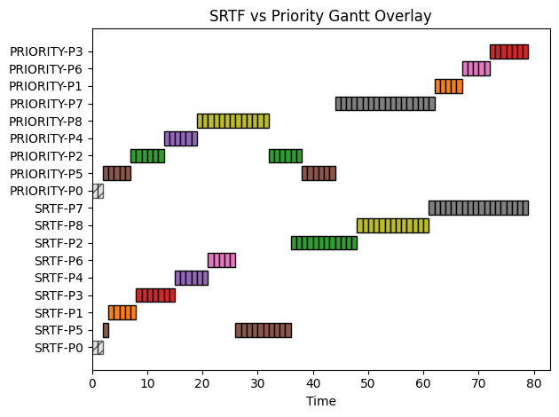

# CPU Scheduling Simulator

This project simulates and compares CPU scheduling algorithms using a time-driven engine.

## Algorithms

* SJF (Shortest Job First)
* SRTF (Shortest Remaining Time First)
* Priority Scheduling

## Clone
```bash
git clone https://github.com/The-OS-Team/CPU-scheduling-simulator.git
cd CPU-scheduling-simulator
```

## Usage
Run from the project root:

Single scheduler `SRTF`:

```bash
python -m src.main --sched srtf --p 8 --mode random
```

Single scheduler `Priority`:

```bash
python -m src.main --sched priority --p 10 --mode random
```
Comparison `SRTF vs Priority`:

```bash
python -m src.main --compare --p 10 --mode random
```

## Arguments

* `--p` : number of processes
* `--sched` : `sjf`, `srtf`, or `priority`
* `--mode` : `simultaneous` or `random`
* `--compare` : run comparison mode

## Output

* Process execution table
* Average metrics (TAT, WT, RT)
* Gantt charts
* Comparison results (if enabled)



## Notes

* Same workload is used for fair comparison
* Input is validated before execution
* CPU is assumed to be single-core

## Result

SRTF generally gives lower waiting and turnaround times. Priority scheduling depends on assigned priorities and may lead to higher waiting times.

