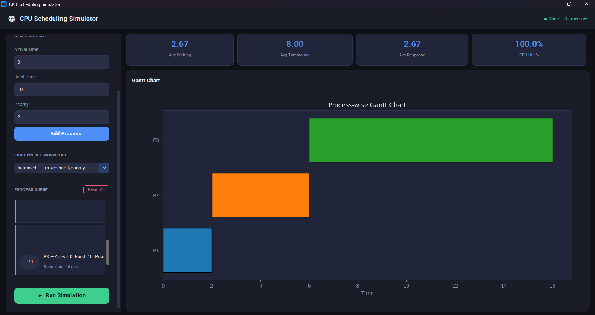
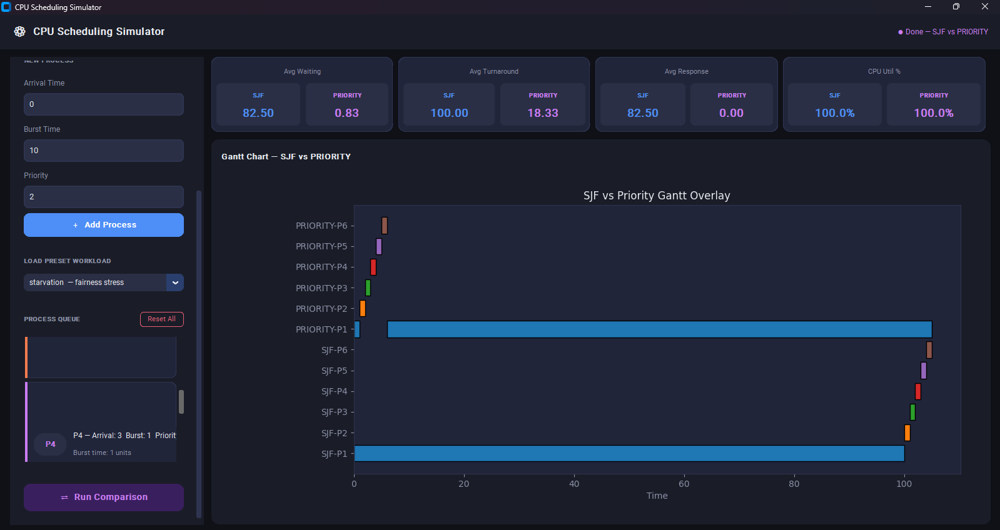

# CPU Scheduling Simulator

> A time-driven CPU scheduling simulator implementing **SJF**, **SRTF**, and **Priority Scheduling** — with both a CLI and a Tkinter GUI. The comparison mode pits **SJF vs Priority Scheduling** head-to-head across predefined workloads.

---

## Table of Contents

- [Overview](#overview)
- [Features](#features)
- [Project Structure](#project-structure)
- [Algorithms](#algorithms)
- [Scheduling Metrics](#scheduling-metrics)
- [Predefined Workloads](#predefined-workloads)
- [Installation](#installation)
- [Usage](#usage)
- [GUI Interface](#gui-interface)
- [Design Decisions](#design-decisions)
- [Results Summary](#results-summary)
- [Assumptions](#assumptions)
- [Authors](#authors)

---

## Overview

This project implements and compares classical CPU scheduling algorithms using a unified, time-driven simulation engine. It is designed to demonstrate correct scheduling behavior, fair algorithm comparison, execution visualization via Gantt charts, and detailed metric analysis.

The primary comparison mode runs **SJF (Shortest Job First)** against **Priority Scheduling** on the same workload, exposing the trade-off between burst-time efficiency and policy-driven task importance.

---

## Features

- Time-driven simulation engine
- Preemptive and non-preemptive scheduling
- Heap-based scheduler optimization using `heapq`
- Process-wise Gantt chart visualization (GUI + CLI overlay)
- Metrics: Waiting Time (WT), Turnaround Time (TAT), Response Time (RT), CPU Utilization
- Deterministic predefined workloads for reproducible testing
- Random workload generation with configurable seeds
- **Side-by-side SJF vs Priority comparison mode** (`--compare`)
- Interactive Tkinter GUI with process queue management

---

## Project Structure

```
src/
├── simulation/
│   ├── config.py          # SimulationConfig — runtime configuration builder
│   ├── runner.py          # SimulationRunner — single-scheduler execution
│   └── comparison.py      # ComparisonRunner — SJF vs Priority side-by-side
├── schedulers/
│   ├── sjf.py             # SJF (non-preemptive)
│   ├── srtf.py            # SRTF (preemptive)
│   └── priority.py        # Priority Scheduling (preemptive)
├── models/
│   └── process.py         # Process data model
├── metrics/
│   └── report.py          # Report + Metrics — TAT, WT, RT, CPU util
├── utils/
│   ├── generator.py       # Random process generator
│   ├── gantt.py           # Gantt chart + overlay plot
│   └── workloads.py       # Predefined deterministic workloads
└── main.py                # Entry point (CLI + GUI launcher)
```

---

## Algorithms

### 1. SJF — Shortest Job First

Non-preemptive. Selects the process with the smallest burst time from the ready queue at the moment the CPU becomes free.

| Property | Detail |
|---|---|
| Type | Non-preemptive |
| Selection | Smallest burst time |
| Strength | Minimizes average waiting time among non-preemptive algorithms |
| Weakness | Starvation for long processes; requires known burst times |

---

### 2. SRTF — Shortest Remaining Time First

Preemptive version of SJF. A new arrival preempts the running process if it has a shorter remaining burst time.

| Property | Detail |
|---|---|
| Type | Preemptive |
| Selection | Smallest remaining burst time |
| Strength | Optimal average waiting time |
| Weakness | Starvation for long processes; high context-switch overhead |

---

### 3. Priority Scheduling

Preemptive priority-based scheduling. Lower priority value = higher urgency.

| Property | Detail |
|---|---|
| Type | Preemptive |
| Selection | Lowest priority number wins |
| Strength | Policy-driven; critical tasks are always served first |
| Weakness | Starvation for low-priority processes |

**Tie-breaking order:** Priority → Arrival Time → PID

---

## Scheduling Metrics

| Metric | Formula |
|---|---|
| Turnaround Time (TAT) | `Finish Time − Arrival Time` |
| Waiting Time (WT) | `TAT − Burst Time` |
| Response Time (RT) | `First Run Time − Arrival Time` |
| CPU Utilization | `Total Busy Time / Total Simulation Time × 100%` |

---

## Predefined Workloads

Defined in `src/utils/workloads.py`. Each is a deterministic set of processes for reproducible comparisons.

| Workload | Description |
|---|---|
| `balanced` | Mixed burst times and priorities — general comparison workload |
| `conflict` | Highlights conflict between burst-time efficiency and priority-based service |
| `starvation` | Demonstrates starvation risk — one long job blocked by many short/high-priority arrivals |
| `simultaneous` | All processes arrive at t=0 — tests tie-breaking under simultaneous arrival |
| `ties` | Validates deterministic tie-breaking (same burst, same priority, same arrival time) |

---

## Installation

Ensure Python 3.8+ is installed. No third-party packages required for core simulation. `matplotlib` is needed for Gantt chart overlays (`--chart`).

```bash
# Clone the repository
git clone https://github.com/<your-repo>/cpu-scheduling-simulator.git
cd cpu-scheduling-simulator

# install dependencies
pip install -r requirements.txt

# Run
python -m src.gui
```

For the GUI, `tkinter` must be available (included in standard Python distributions).

---

## Usage

### Run a Single Scheduler

```bash
python -m src.main --sched sjf --p 10
python -m src.main --sched priority --p 8
python -m src.main --sched srtf --p 6
```

### Compare SJF vs Priority *(primary comparison mode)*

```bash
python -m src.main --compare --p 10
```

### Run with a Predefined Workload

```bash
python -m src.main --compare --workload balanced
python -m src.main --compare --workload conflict
python -m src.main --sched sjf --workload starvation
python -m src.main --sched priority --workload ties
```

### Generate Gantt Chart Overlay

```bash
python -m src.main --compare --workload balanced --chart
```

### Full CLI Argument Reference

| Argument | Values | Description |
|---|---|---|
| `--p` | integer | Number of processes (random mode) |
| `--sched` | `sjf`, `srtf`, `priority` | Scheduler type (single-scheduler mode) |
| `--mode` | `simultaneous`, `staggered`, `random` | Arrival pattern for random workloads |
| `--compare` | flag | Run SJF vs Priority side-by-side |
| `--workload` | see table above | Load a predefined deterministic workload |
| `--chart` | flag | Display Gantt chart overlay after simulation |
| `--seed` | integer or `none` | Random seed for reproducibility |

### Example CLI Output

```
CPU SCHEDULING SIMULATOR
======================================================================
▶️ Running Scheduler Comparison (SJF vs Priority)
======================================================================
SCHEDULER COMPARISON
======================================================================
SJF
Avg TAT: 13.00
Avg WT : 6.50
Avg RT : 4.25
Total Time: 26.00
CPU    : 100.00%

PRIORITY
Avg TAT: 13.00
Avg WT : 6.50
Avg RT : 4.25
Total Time: 26.00
CPU    : 100.00%
```

---

## GUI Interface

Launch the Tkinter GUI by running without CLI arguments:

```bash
python -m src.gui
```

### Running one scheduler: 


### Running a Comparison:


### GUI Features

| Element | Description |
|---|---|
| Algorithm toggle | Switch between SJF and Priority with one click |
| Add Process form | Enter Arrival Time, Burst Time, and Priority manually |
| Load Preset Workload | Select workload from dropdown and click Load |
| Process Queue | Live scrollable list of all added processes |
| Reset All | Clears the queue and resets the Gantt chart |
| Gantt Chart | Process-wise colored chart rendered after simulation |
| Metric cards (top) | Displays Avg WT, Avg TAT, Avg RT, CPU Utilization |

---

## Design Decisions

### Heap-Based Ready Queue

All schedulers use Python's `heapq` min-heap for the ready queue:

- Insertion: O(log n)
- Extraction: O(log n)

This is more efficient than repeated linear sorting, especially for larger process sets.

### Unified Comparison Architecture

`ComparisonRunner` (in `comparison.py`) runs multiple schedulers on **identical deep-copied configurations**, ensuring a fair comparison. The workflow:

1. Deep-copy `SimulationConfig` for each scheduler
2. Run `SimulationRunner` independently per scheduler
3. Collect metrics via `Report`
4. Print side-by-side results and (optionally) render a Gantt overlay via `plot_overlay_gantt`

Schedulers only implement two responsibilities: selecting the next process and determining the execution slice. All lifecycle management (arrival, preemption, completion, clock progression) lives in the engine — a clean separation of concerns.

---

## Results Summary

The comparison focuses on **SJF vs Priority** across four workloads:

| Scenario | SJF Behavior | Priority Behavior |
|---|---|---|
| Balanced | Strong average WT/TAT | May match SJF when priority order aligns with burst order |
| Conflict | Short jobs always run first regardless of priority | High-priority long job monopolizes CPU |
| Starvation | Long job delayed by stream of short arrivals | Low-priority job indefinitely delayed |
| Ties | Deterministic by arrival time + PID | Deterministic by priority + arrival + PID |

**Key insight:** SJF optimizes for average performance (minimizing WT/TAT). Priority Scheduling is essential when task urgency must override burst-time efficiency — but at the cost of potential starvation for low-priority processes.

### Starvation Mitigation

Real operating systems address starvation using aging (gradually raising process priority over time), multi-level feedback queues, and dynamic priority adjustment. This simulator intentionally omits these to keep starvation scenarios clearly observable and educational.

---

## Assumptions

- Single-core CPU (no parallelism)
- No I/O blocking or waiting states
- No context-switch overhead
- Burst times are known in advance
- Process execution is deterministic

---

## Authors

Operating Systems Scheduling Project — Team Leader ID: **101**